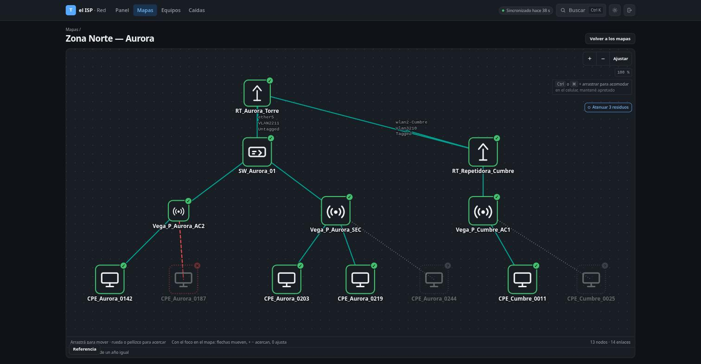
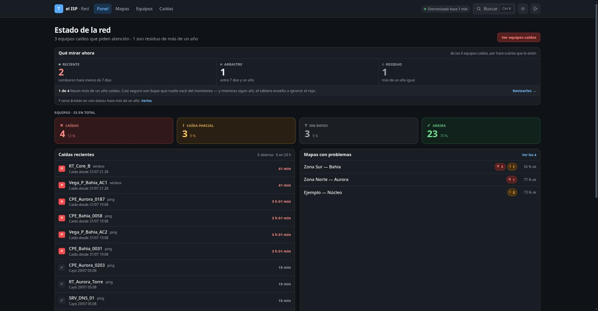
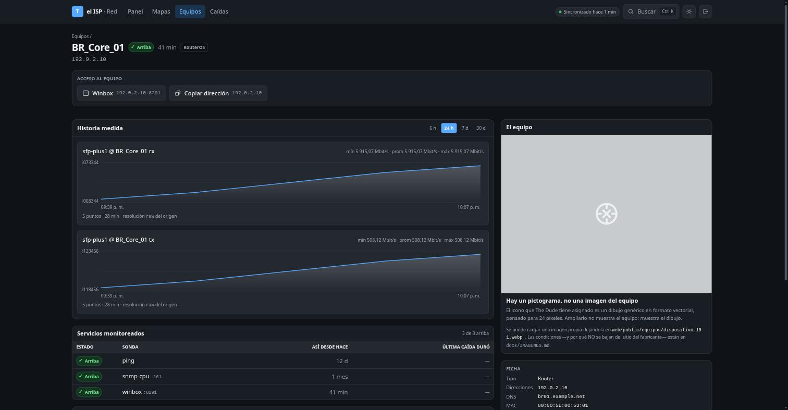
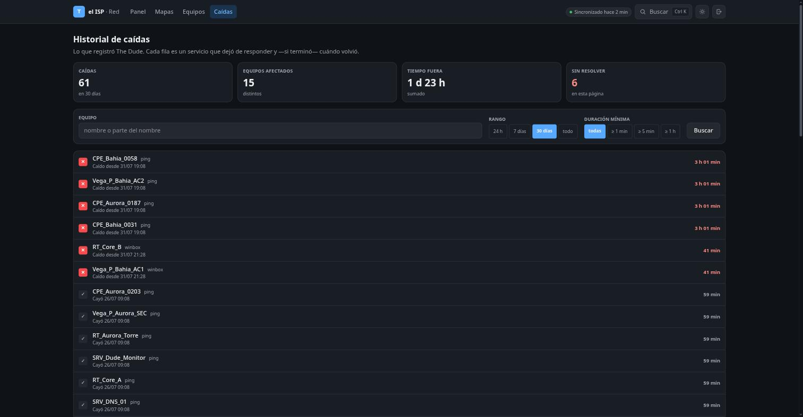

# dudepanel

**Un panel web moderno para The Dude 4.0beta3**, el monitor de red de MikroTik
que salió en 2011 y está discontinuado desde entonces.

Lee su base SQLite **en sólo lectura**, la replica a PostgreSQL con un modelo
relacional propio, y sirve una interfaz en Astro + Tailwind: mapas de topología,
búsqueda por nombre o IP, estado en vivo, desde cualquier navegador.



> 🔴 **Las cuatro capturas de este documento salen del seed de desarrollo, no de
> una red real.** Es dato sintético: los nombres son inventados, las direcciones
> están en los rangos que el RFC 5737 reserva para documentación (`192.0.2.0/24`)
> y las MAC en el de la RFC 7042 (`00:00:5E:00:53:xx`).
>
> No es prolijidad: cualquier captura de una instalación de verdad publica el
> nombre, la dirección y la topología de los equipos de alguien. Y hay un test
> —`web/test/seed.test.ts`— que falla si una dirección real aparece en el
> repositorio, incluso dentro de un comentario.
>
> Reproducilas con `docker compose up -d` y `psql < web/seed-dev.sql`.

<table>
<tr>
<td width="50%"><a href="docs/capturas/panel.jpg"></a></td>
<td width="50%"><a href="docs/capturas/equipo.jpg"></a></td>
</tr>
<tr>
<td><b>Tablero.</b> Los caídos separados por hace cuánto lo están: «4 caídos» y «3 recientes + 1 residuo de más de un año» describen la misma red y piden cosas distintas.</td>
<td><b>Ficha del equipo.</b> Accesos por protocolo derivados de los servicios que existen, historia medida, y la imagen del modelo cuando se puede saber cuál es.</td>
</tr>
<tr>
<td colspan="2"><a href="docs/capturas/caidas.jpg"></a></td>
</tr>
<tr>
<td colspan="2"><b>Historial de caídas.</b> Filtrable por rango, duración mínima y equipo. El filtro de duración es el que lo hace usable: sin él, las caídas de treinta segundos —ruido de sondeo— entierran a las de dos horas.</td>
</tr>
</table>

---

## El problema que resuelve

The Dude sigue siendo bueno en lo suyo, pero su cliente es una aplicación
Windows que corre en **una** máquina. Para ver la red hay que ir hasta ahí. Trae
un servidor web propio, sí — de 2005, con maquetación por tablas anidadas, sin
responsive, que recarga la página entera cada 30 segundos.

Y su base es una sola tabla de blobs binarios: no se puede consultar, ni
agregar, ni cruzar con nada.

```
dude.db (SQLite, intocable)  ──copia──►  ETL  ──►  PostgreSQL  ──►  panel web
```

> 🔴 **Dice «copia» y no «lectura directa» por una razón medida.** The Dude
> corre con `locking_mode=EXCLUSIVE`: toma el bloqueo del archivo al arrancar
> y **no lo suelta nunca**. Contra la base viva, un lector externo recibe
> `database is locked` siempre — 0 lecturas exitosas en 60 intentos. El ETL
> copia la base y su journal, verifica que el origen no se movió durante la
> copia, lee la copia y la borra. Ver `dudeobj.instantanea`.

| lo que aporta | cómo |
|---|---|
| **Consultable desde cualquier lado** | Navegador, también en el teléfono |
| **SQL de verdad** | `JOIN`, índices, agregaciones, búsqueda por trigramas |
| **Riesgo cero para producción** | Sólo lectura, montaje `:ro`, otra máquina si hace falta |
| **Sin credenciales** | Ver abajo. Es la decisión de diseño más importante |
| **Sobrevive a The Dude** | El día que migren a otro monitor, cambia quién alimenta Postgres. La gente sigue mirando el mismo panel |

### Y algo que no es obvio

The Dude guarda todo en un SQLite de 32 bits. En junio de 2026 esa base **chocó
contra 2 GiB y murió**, y hubo que rearmarla desde cero perdiendo la historia.
El techo sigue exactamente donde estaba.

Replicando la historia a PostgreSQL, la base local se puede podar: **el techo
deja de ser una cuenta regresiva.**

---

## 🔴 Sobre las credenciales

The Dude conserva el usuario y la contraseña de acceso a **cada equipo
monitoreado**, en forma recuperable. No puede hacer otra cosa: tiene que
presentarlos al autenticarse, y un sistema que presenta secretos no puede
guardar hashes.

**Este proyecto no los enmascara: no los lee.**

```python
SECRETO = re.compile(r"(pass|pwd|secret|community|privkey|authkey|wpa|psk|^user$)", re.I)
```

Los campos existen en el origen —`pwd` en 885 objetos, `user` en 885,
`community` en 3— y el decodificador los omite. Hay un test que lo verifica en
cada corrida.

**Una base que no los contiene no los puede filtrar**: ni por un fallo, ni por
un volcado, ni por un respaldo mal guardado.

---

## Cómo levantarlo

```bash
cp .env.example .env
$EDITOR .env                     # POSTGRES_PASSWORD y DUDE_DATA
docker compose up -d
```

El panel queda en `http://127.0.0.1:4321` **del anfitrión**, a propósito. Para
llegarle desde otra máquina:

```bash
ssh -L 4321:127.0.0.1:4321 usuario@servidor
```

> ⚠️ **No lo publiques en una placa pública sin poner un proxy inverso con TLS
> real y autenticación delante.** No es paranoia de manual: en este mismo
> despliegue, encender el servidor web propio de The Dude dejó su login de 2011
> —con el certificado de ejemplo de MikroTik de 2005 y TLSv1— atendiendo desde
> internet, porque el puerto ya estaba abierto en el cortafuegos «sin nada
> detrás». Poner un servicio detrás de un puerto abierto lo convierte en puerta.

### Requisitos del origen

- `dude.db` accesible en un **sistema de archivos local**. Nunca NFS, CIFS ni
  virtiofs: SQLite depende de bloqueos POSIX confiables. Un *block device* de
  red (iSCSI, Ceph RBD, qcow2 sobre NFS) sí sirve.
- El directorio `files/` al lado, que es de donde salen los iconos SVG: en la
  base sólo está el índice, los bytes están en disco.
- **Legible por el usuario del contenedor** (uid 10001). The Dude deja su base
  en `600 root:root`; hay que darle un grupo. Ver `docs/PRODUCCION.md`.
- **Espacio para una copia más** del tamaño de `dude.db` + su journal, en el
  volumen `etl-trabajo`. Dura lo que dura una corrida.

### 🔴 Lo que no se puede hacer, y cuesta un día descubrirlo

**Leer `dude.db` mientras The Dude corre.** No es contención ocasional: es un
lock `EXCLUSIVE` permanente. Medido en producción, en `/proc/locks`:

```
POSIX  ADVISORY  WRITE  <pid de wineserver32>  bytes 1073741824 … 1073742335
```

`1073741824` es `0x40000000`, el PENDING_BYTE de SQLite; el rango cubre
PENDING + RESERVED + los 510 bytes de SHARED, tomado entero como WRITE.

Y esto **no aparece en desarrollo**, porque ahí se apunta el ETL a una copia
muerta y nadie escribe del otro lado. La primera vez que este proyecto vio un
The Dude corriendo fue en producción: cuatro contenedores en `healthy`,
certificado válido, sitio contestando 200 — y cero equipos.

**Un panel vacío no se lee como un fallo. Se lee como una red sin equipos.**

---

## Estructura

```
docs/FORMATO-DUDE.md   El contrato: cómo se lee el formato binario de The Dude.
                       Todo medido sobre una base real de 14.925 objetos.
etl/dudeobj.py         Decodificador. Sólo lectura, sin credenciales.
etl/schema.sql         Esquema de PostgreSQL. El contrato con el frontend.
etl/sync.py            El servicio de sincronización.
web/                   Astro + Tailwind, SSR.
```

**Empezá por `docs/FORMATO-DUDE.md`.** MikroTik nunca documentó este formato y
no lo va a hacer: 4.0beta3 es de enero de 2011, es la última versión para
Windows y está discontinuada.

Eso, que suena a problema, **es la garantía del proyecto: el formato no puede
cambiar porque el proveedor se fue.**

---

## Cómo se verificó que el decodificador acierta

The Dude trae un servidor web propio que muestra los mismos datos en tablas.
Está apagado de fábrica y se puede encender.

**Ese es el oráculo**: cualquier duda de semántica se resuelve comparando la
salida del panel contra la suya, servicio por servicio, 859 veces. Convierte la
ingeniería inversa de un formato binario en algo demostrable, no en una apuesta.

---

## Estado

Los números de referencia, de una instalación real:

| | |
|---|---:|
| Dispositivos | 885 |
| Servicios monitoreados | 859 |
| Enlaces | 1.171 |
| Mapas | 40 |
| Elementos de mapa dibujados | 2.317 |
| Objetos totales en el origen | 14.925 |

---

## Licencia

MIT.

The Dude es marca de MikroTik. Este proyecto **no lo incluye, no lo modifica y
no lo redistribuye**: sólo lee su base de datos, en sólo lectura.
